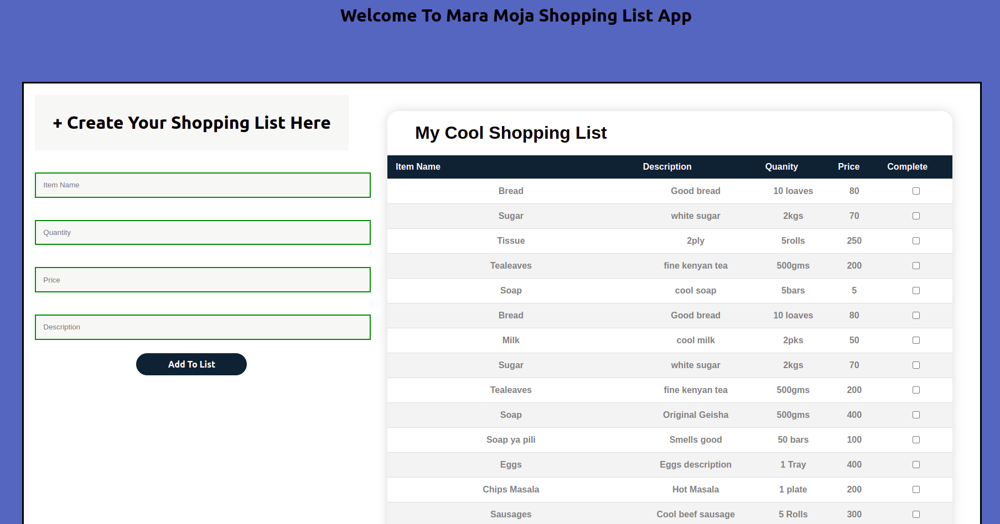

# Mara Moja Shopping List App 

This is the Frontend of a group project created in November 2022 at the end of phase 3 of our Software Engineering Bootcamp at Moringa School.

### Contributors

* James Njenga
* Muriithi Kibata
* Pauline Muthoni
* Ruth Mwangeka
* Isaac Sindiga

## Description

Mara Moja is a shopping list app that allows users to sign up for an account and then create a shopping list with item names, prices, and descriptions. After purchasing an item, the user may be able to check it off their list.

## Technologies Used
* HTML
* CSS
* ReactJS
* Ruby
* Sinatra API Server

## Setup / Installation Requirements

* Backend server :https://github.com/JamesKibathi/grp4-backend-new
* Web Browser
* Internet connection

## MVPs

A landing page with:

* Login and SignUp Form

* Form To Add Shopping Items

* Shopping List Display Section

### Installation steps

* The API is built on localhost.

* To run locally, fork and clone the repository to your local machine, then run `npm install` to add dependencies.

* Fork and clone the backend API (https://github.com/JamesKibathi/grp4-backend-new) and follow the installation steps as outlined on the README of the repo.

* Run and start the server.

* Upon successfully starting the server, Run `npm start` and the app will launch on the browser.

### How it works

After a successful launch, the user is redirected to a login page

If you don't have an account already, you will be allowed to create one
by clicking on the link: `Don't have an account? Create Account`

Upon a successful Login, You will be redirected to your account where you will be
able to generate a shopping list.

#### Admin Logins
If you don't want to create an account, you can login with the following credentials:

* Username : Jay
* Password: N123

## Known Bugs

User authentication is not properly handled. I'll come back to this when we get to rails.

## Support and contact details

Email - njenga.consulting@gmail.com

Let's connect on Linkein: https://www.linkedin.com/in/james-njenga-a2521b1b6/

## MIT License

Copyright (c) 2022 **James Njenga**

Permission is hereby granted, free of charge, to any person obtaining a copy
of this software and associated documentation files (the "Software"), to deal
in the Software without restriction, including without limitation the rights
to use, copy, modify, merge, publish, distribute, sublicense, and/or sell
copies of the Software, and to permit persons to whom the Software is
furnished to do so, subject to the following conditions:

The above copyright notice and this permission notice shall be included in all
copies or substantial portions of the Software.

THE SOFTWARE IS PROVIDED "AS IS", WITHOUT WARRANTY OF ANY KIND, EXPRESS OR
IMPLIED, INCLUDING BUT NOT LIMITED TO THE WARRANTIES OF MERCHANTABILITY,
FITNESS FOR A PARTICULAR PURPOSE AND NONINFRINGEMENT. IN NO EVENT SHALL THE
AUTHORS OR COPYRIGHT HOLDERS BE LIABLE FOR ANY CLAIM, DAMAGES OR OTHER
LIABILITY, WHETHER IN AN ACTION OF CONTRACT, TORT OR OTHERWISE, ARISING FROM,
OUT OF OR IN CONNECTION WITH THE SOFTWARE OR THE USE OR OTHER DEALINGS IN THE
SOFTWARE.

